# Laya Pipeline

**A tiny classifier makes the decisions, your local LLMs do the writing.**

Every request to your local models first goes through [Laya](https://huggingface.co/convaiinnovations/laya), a 420M-parameter decision model that answers typed questions in about 300 ms on a CPU. It decides which context to keep, which model to use, whether that model should think first, and whether the answer is good enough. Large models in [LM Studio](https://lmstudio.ai) then generate the answer. A live dashboard shows each decision as it happens, and the Lab tab lets you tune Laya on your own labels.

<picture>
  <source media="(prefers-color-scheme: dark)" srcset="docs/img/live-dark.png">
  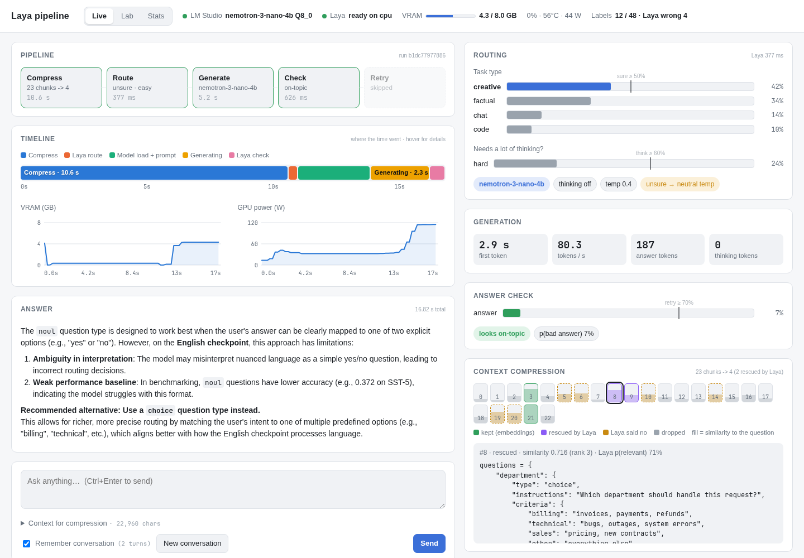
</picture>

---

## Contents

- [Why](#why)
- [How a request flows](#how-a-request-flows)
- [The four stages](#the-four-stages)
- [Quick start](#quick-start)
- [The dashboard](#the-dashboard)
- [Teaching Laya: the feedback loop](#teaching-laya-the-feedback-loop)
- [Architecture](#architecture)
- [Commands](#commands)
- [Configuration](#configuration)
- [Hardware notes](#hardware-notes)
- [Honest limits](#honest-limits)
- [Project layout](#project-layout)
- [Credits and license](#credits-and-license)

---

## Why

Running local models on a consumer GPU means trade-offs everywhere:

- **A small model is fast but weak; a big model is good but slow.** You want the big one only when the request needs it.
- **"Thinking" models can spend hundreds of hidden tokens** on a one-line question. Thinking should be switched on for hard problems only.
- **Long documents don't fit,** or they drown the question. Only the relevant parts should reach the model.
- **Sometimes the answer misses the point.** Ideally something checks it and retries on the stronger setup.

Asking an LLM to make these decisions costs as much as the answer itself. Laya is a classifier, not a generator, so it can't hallucinate. It returns a probability for each option in a single forward pass. That makes it cheap enough to put in front of every request.

## How a request flows

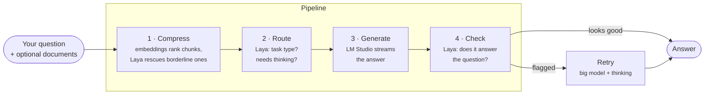

Laya runs on the **CPU** (about 300 ms per decision), so all of the GPU's memory stays free for the language models.

## The four stages

### ① Compress: only relevant context reaches the model

When you attach documents, they're split into chunks of about 1,200 characters. An embedding model ranks every chunk against your question. The best few are kept outright. The next tier is borderline, and Laya judges each borderline chunk on its own: *"does this passage help answer the question?"*

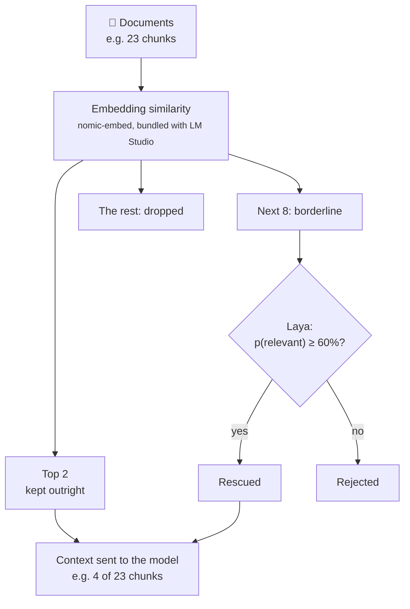

### ② Route: pick the model, the thinking mode and the temperature

Laya answers two questions in one pass: *what kind of request is this* (code, factual, creative, chat) and *how much thinking does a good answer need*. Thresholds turn those probabilities into settings. When Laya isn't sure, the pipeline falls back to safe defaults instead of trusting a guess.

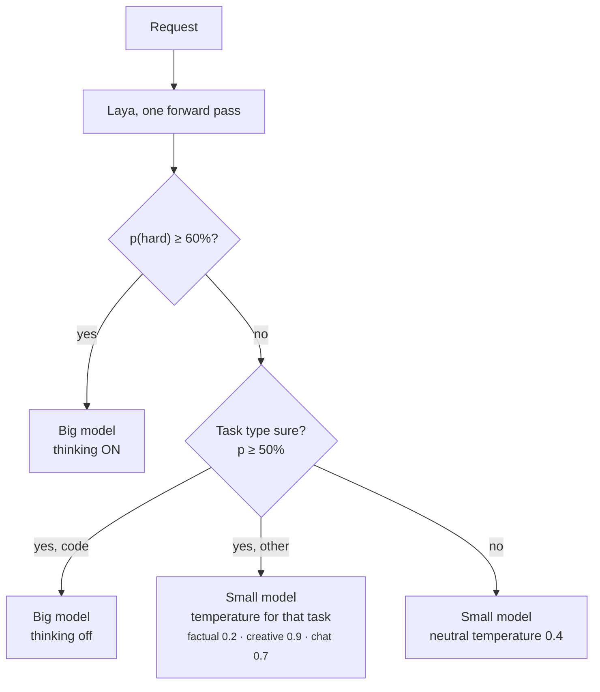

With documents attached, the temperature is capped at 0.3 and the model is told to answer from the context or say it can't.

### ③ Generate

[LM Studio](https://lmstudio.ai) serves the models through its OpenAI-compatible API, loading and unloading them on demand. The answer streams into the dashboard token by token. If thinking is on, the model's reasoning streams into a collapsible box.

### ④ Check and retry

Laya reads the question and the answer and estimates *p(bad answer)*. At 70% or above, the pipeline retries once on the big model with thinking on.

## Quick start

### You need

| | |
|---|---|
| **[LM Studio](https://lmstudio.ai)** | Runs the language models. Install it and open it once, which also installs its `lms` command. |
| **[uv](https://docs.astral.sh/uv/getting-started/installation/)** | Python package manager. It installs Python 3.12+ and every dependency for you. |
| **Disk space** | About 11 GB for the two default models, plus about 5 GB of Python packages (PyTorch). |
| **GPU** | Optional but strongly recommended. Tested on an 8 GB laptop RTX 3070. Laya itself runs on the CPU. |

### Run it

```bash
git clone https://github.com/trifleen/laya-pipeline.git
cd laya-pipeline
./laya setup     # one time: downloads the models via LM Studio and Laya's weights, then checks everything
./laya           # starts LM Studio's server and the dashboard, opens http://localhost:8765
```

That's it. Press **Ctrl+C** to stop. Running `./laya` again reuses a dashboard that's already running, and restarts it automatically if the code has changed.

> **Without bash** (for example on Windows): use `uv run laya-pipeline setup` and `uv run laya-pipeline up`.
>
> **Run `laya` from any folder:** `ln -s "$PWD/laya" ~/.local/bin/laya`

### Prefer the terminal?

```bash
./laya ask "What's the difference between TCP and UDP?"
./laya ask "Summarise the risks" -c report.md -c notes.txt
./laya chat -c notes.md
```

After each answer, a dimmed line shows Laya's routing decision and the timings.

## The dashboard

### Live: watch each decision as it happens

<table>
<tr>
<td width="50%">
<picture><source media="(prefers-color-scheme: dark)" srcset="docs/img/routing-dark.png">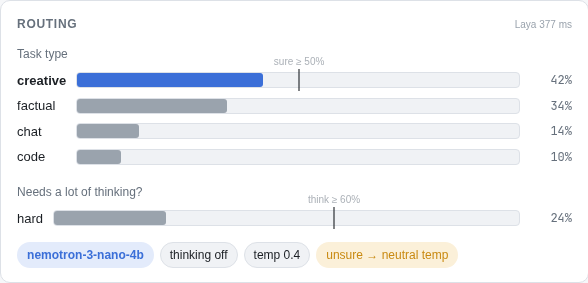</picture>
<p><b>Routing:</b> Laya's probabilities, with each threshold drawn in, and the resulting model, thinking mode and temperature.</p>
</td>
<td width="50%">
<picture><source media="(prefers-color-scheme: dark)" srcset="docs/img/compression-dark.png">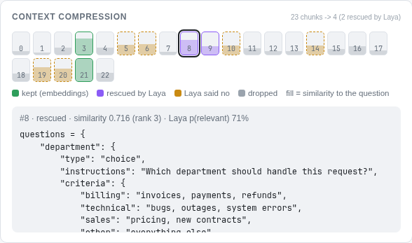</picture>
<p><b>Compression:</b> every chunk of your documents, coloured by what happened to it. Click one to read it with its scores.</p>
</td>
</tr>
</table>

<picture><source media="(prefers-color-scheme: dark)" srcset="docs/img/timeline-dark.png">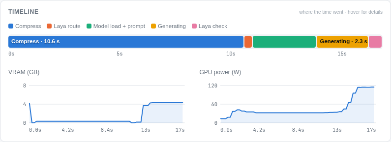</picture>

**Timeline:** where the time went in each run. Model loading is shown separately from generating, and VRAM and GPU power are sampled every 250 ms underneath. In the run above, most of the 17 s went to compression, because the embedding model had to load first. The GPU only reached full power during generation.

<picture><source media="(prefers-color-scheme: dark)" srcset="docs/img/history-dark.png">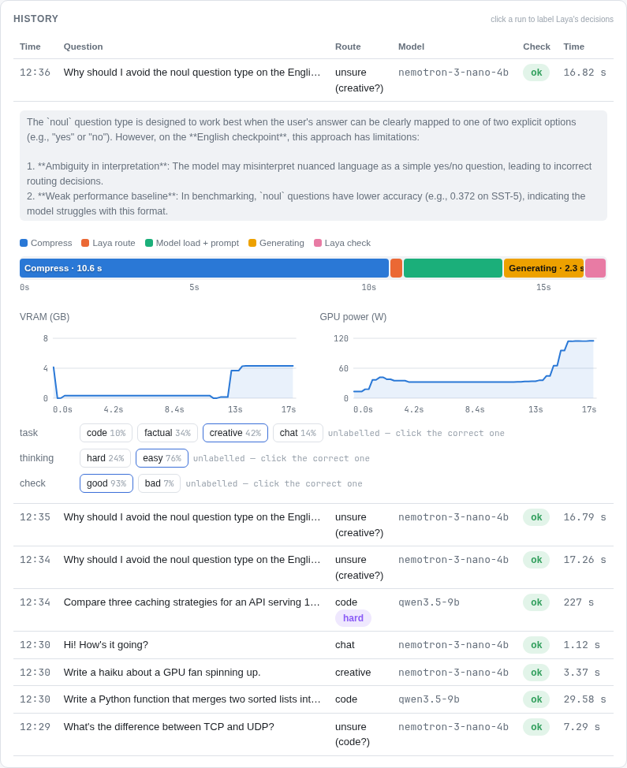</picture>

**History:** every past run. Expand one to see its timeline and to **label Laya's decisions** with one click. Those labels feed the Lab.

### Lab: make Laya better at *your* requests

<picture><source media="(prefers-color-scheme: dark)" srcset="docs/img/lab-whatif-dark.png">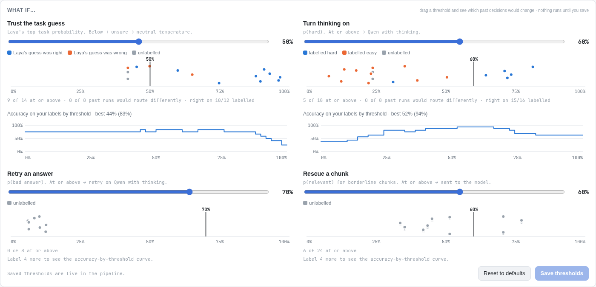</picture>

**What if…:** drag any threshold and see which past decisions would change. Each dot is one decision, coloured by your label. The panel also shows how many past runs would be routed differently, and an accuracy-by-threshold curve. Nothing changes until you click **Save**.

<table>
<tr>
<td width="50%" valign="top">
<picture><source media="(prefers-color-scheme: dark)" srcset="docs/img/lab-calibration-dark.png">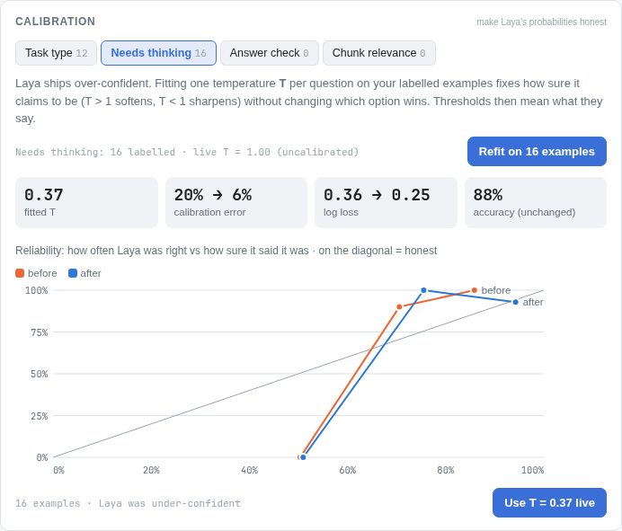</picture>
<p><b>Calibration:</b> fits one temperature per question so Laya's "70% sure" really means right 70% of the time. The reliability chart shows the before and after.</p>
</td>
<td width="50%" valign="top">
<picture><source media="(prefers-color-scheme: dark)" srcset="docs/img/lab-editor-dark.png">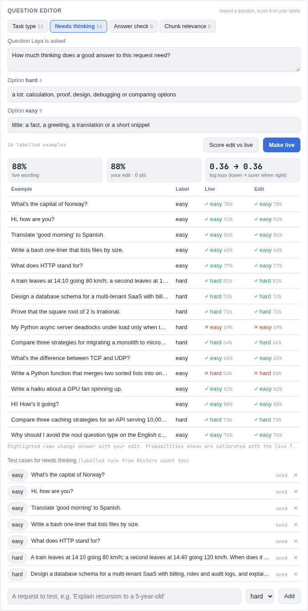</picture>
<p><b>Question editor:</b> reword what Laya is asked and score the edit against the live wording on every labelled example before making it live.</p>
</td>
</tr>
</table>

### Stats

<picture><source media="(prefers-color-scheme: dark)" srcset="docs/img/stats-dark.png">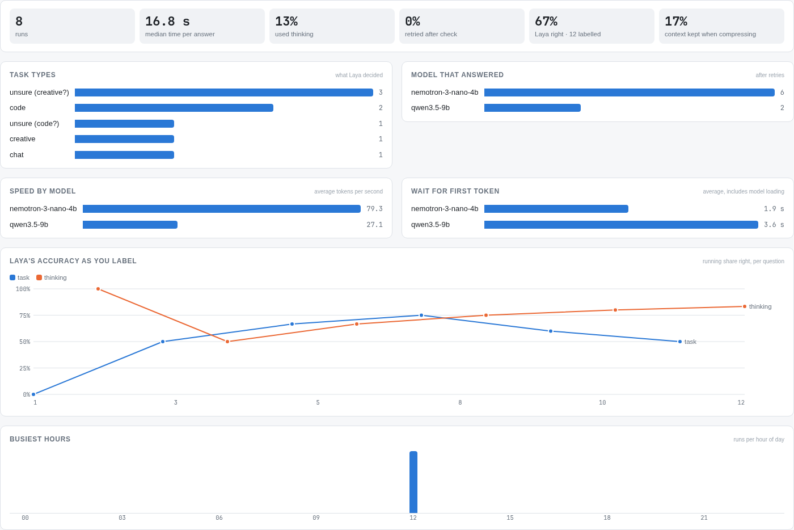</picture>

## Teaching Laya: the feedback loop

Out of the box, Laya is a general-purpose decision model. It does well on clear cases but stumbles on borderline ones (see [Honest limits](#honest-limits)). The dashboard is built to close that gap with your own data:

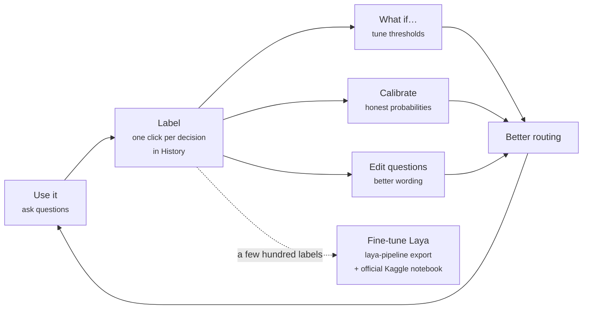

A starter set of 16 hand-labelled test cases is created on first run, so the Lab has something to work with straight away. When you've collected a few hundred labels, `laya-pipeline export` writes them to `logs/dataset.jsonl`, ready for Laya's [fine-tuning notebook](https://github.com/NandhaKishorM/laya/blob/main/notebooks/laya_finetune_typed_decisions_2xT4_kaggle.ipynb), which runs on Kaggle's free GPUs. On Laya's own benchmark, fine-tuning raised accuracy from 0.36 to 0.77.

## Architecture

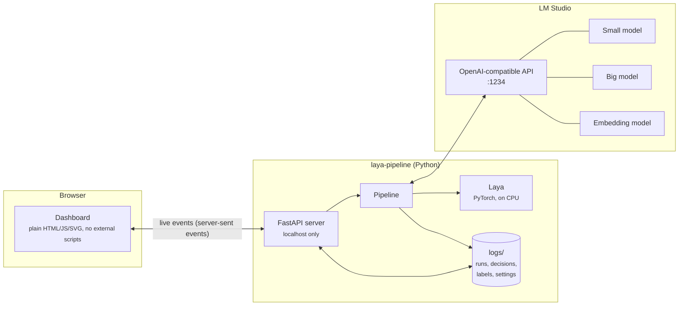

**Everything stays on your machine.** The server only listens on `127.0.0.1`, and your questions, answers and labels are stored in `logs/`, which git ignores. The only network traffic is the one-time model downloads, from LM Studio's catalogue and Hugging Face.

## Commands

| Command | What it does |
|---|---|
| `./laya setup` | One time: downloads missing models through LM Studio, loads Laya (downloading its weights the first time), then runs `doctor`. |
| `./laya` | Starts LM Studio's server and the dashboard, then opens it. Flags: `--no-open`, `--restart`, `--port N`. |
| `./laya ask "…" [-c file]…` | Answers one question in the terminal, optionally with context files. |
| `./laya chat [-c file]…` | Interactive chat in the terminal. |
| `./laya doctor` | Checks PyTorch and CUDA, free VRAM, where Laya will run, and which models LM Studio can serve. |
| `./laya review` | Labels logged decisions in the terminal (the dashboard's History does the same). |
| `./laya export` | Writes labelled decisions to `logs/dataset.jsonl` for fine-tuning. |

`./laya <command>` is shorthand for `uv run laya-pipeline <command>`.

## Configuration

Everything has a default, and any setting can be overridden with an environment variable of the same name, for example `KEEP_CHUNKS=10 ./laya`. The thresholds can also be changed and saved from the Lab tab.

| Variable | Default | Meaning |
|---|---|---|
| `SMALL_MODEL` | `nvidia/nemotron-3-nano-4b` | Fast model for easy requests (an LM Studio model ID, as shown by `lms ls`). |
| `BIG_MODEL` | `qwen/qwen3.5-9b` | Strong model for code, hard requests and retries. |
| `BIG_MODEL_DOWNLOAD` | `qwen/qwen3.5-9b@q4_k_m` | The variant `setup` downloads (Q4 fits an 8 GB GPU). |
| `EMBED_MODEL` | `text-embedding-nomic-embed-text-v1.5` | Embedding model for compression (bundled with LM Studio). |
| `LAYA_DEVICE` | `cpu` | `cpu` keeps the VRAM for the LLMs; `cuda` or `auto` to try the GPU. |
| `HARD_MIN_PROB` | `0.6` | p(hard) needed to use the big model with thinking. |
| `TASK_MIN_PROB` | `0.5` | Below this, Laya's task guess is ignored and a neutral temperature is used. |
| `BAD_ANSWER_MIN_PROB` | `0.7` | p(bad answer) that triggers a retry. |
| `RELEVANCE_MIN_PROB` | `0.6` | p(relevant) needed to rescue a borderline chunk. |
| `KEEP_CHUNKS` | `6` | The most context chunks sent to the model. |
| `LMSTUDIO_URL` | `http://localhost:1234/v1` | LM Studio's API. |
| `LAYA_LOG_DIR` | `./logs` | Where runs, labels and Lab settings are stored. |

**Using other models:** any models LM Studio can run will work. Download them in LM Studio, then set `SMALL_MODEL` and `BIG_MODEL` to their IDs from `lms ls`. Thinking is switched off with `reasoning_effort: none`; models without a thinking mode simply ignore it.

**Changing what Laya is asked:** edit the questions in the Lab's question editor, or change the defaults in [`src/laya_pipeline/questions.py`](src/laya_pipeline/questions.py).

## Hardware notes

- **8 GB of VRAM holds one model at a time.** LM Studio swaps models on demand, and the dashboard shows the swap as "model load" in the timeline. Leave LM Studio's *unload previous JIT model* setting on, which is the default, and don't pin models manually, or a swap may not fit.
- **Laya runs on the CPU on purpose.** On the GPU it would take about 1.7 GB from the language models. On the CPU it costs about 300 ms per decision.
- **Laptop GPUs work fine.** The tested RTX 3070 *Laptop* needed no special setup.
- **Thinking is expensive.** A hard design question with thinking on took nearly 4 minutes on the test machine, compared with 1–30 s without. That's exactly why the pipeline only turns it on when Laya thinks it's needed.
- **No NVIDIA GPU?** Everything still runs, just more slowly. The GPU charts stay empty without `nvidia-smi`. On Linux, uv installs the CUDA build of PyTorch by default, which is the large download.

Tested on Linux (Arch / Omarchy) with an RTX 3070 Laptop GPU. macOS and Windows should work through `uv run laya-pipeline …`, but they haven't been tested yet.

## Honest limits

- **Laya's zero-shot judgement is unreliable on borderline cases.** Laya's own README reports its base checkpoints near chance on unfamiliar decision sets until they're fine-tuned. In testing here, the exact wording mattered: the same maths problem scored 81% "hard" when it ended with "Show the steps" and 36% without. The guardrails (thresholds, unsure fallbacks, the answer check) limit the damage, and the Lab plus your labels are the way to improve it.
- **The answer check is shallow.** It catches off-topic or evasive answers. It doesn't verify facts.
- **Compression follows your wording.** If the question doesn't share words or meaning with the relevant passage, embeddings can miss it. The chunk map makes those misses visible.
- **One question at a time.** There's one GPU, so the dashboard runs one request at a time.

## Project layout

```
laya-pipeline/
├── laya                      # shortcut script: ./laya, ./laya setup, ./laya ask …
├── pyproject.toml            # dependencies (installed by uv)
├── src/laya_pipeline/
│   ├── pipeline.py           # the four stages: compress → route → generate → check
│   ├── questions.py          # what Laya is asked (editable from the Lab)
│   ├── config.py             # settings and thresholds (env vars override)
│   ├── lab.py                # evaluation, test cases, calibration
│   ├── server.py             # dashboard API and live event stream
│   ├── launcher.py           # `setup` and `up`
│   ├── log.py                # decision and run logs, labelling, export
│   └── static/               # the dashboard: index.html, app.css, *.js (no build step)
└── logs/                     # created at runtime, git-ignored: your runs, labels and settings
```

## Credits and license

- **[Laya](https://huggingface.co/convaiinnovations/laya)** by Convai Innovations (Apache-2.0): the decision model this project is built around.
- **[LM Studio](https://lmstudio.ai)** runs the language models. The defaults are [Nemotron 3 Nano 4B](https://huggingface.co/nvidia) and [Qwen3.5 9B](https://huggingface.co/Qwen), with nomic-embed for compression.

This project is licensed under the [Apache License 2.0](LICENSE).
