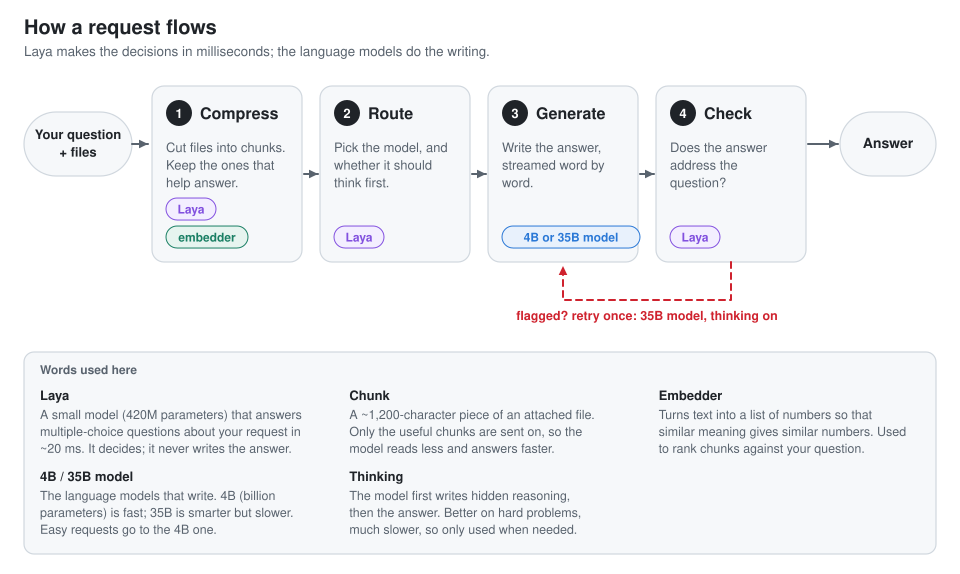
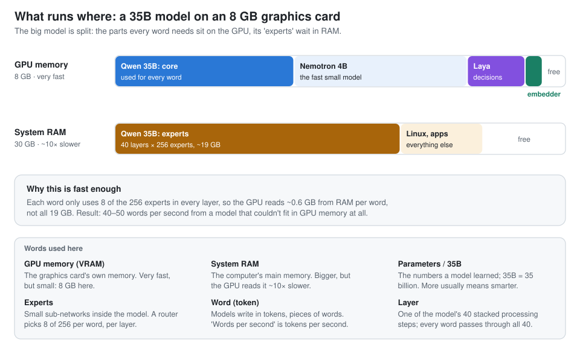
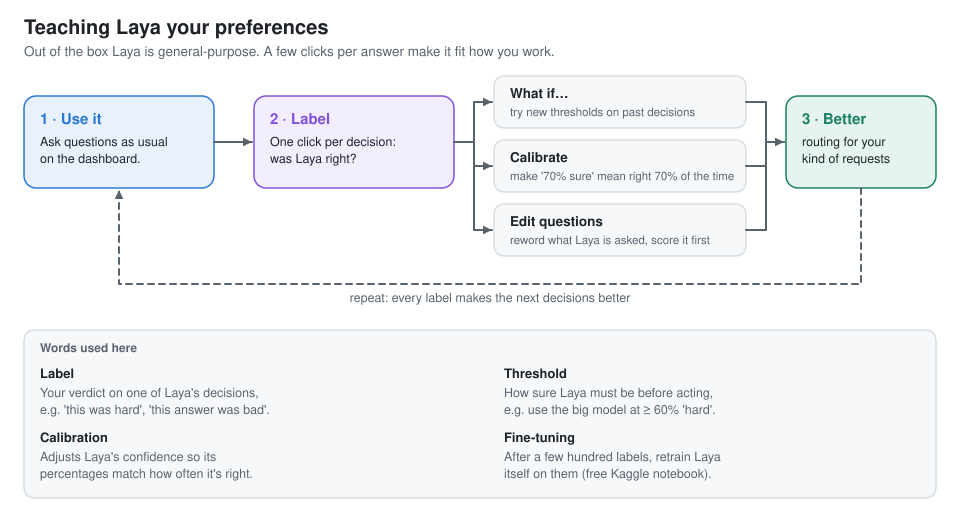

# Laya Pipeline

**A tiny classifier makes the decisions, your local LLMs do the writing.**

Every request first goes through [Laya](https://huggingface.co/convaiinnovations/laya), a 420M-parameter decision model. In a fraction of a second (20–150 ms) it decides which parts of your files to keep, which model should answer, whether that model should think first, and whether the answer is good enough. The writing is done by local models: by default a fast 4B model, plus a 35B model that runs on an 8 GB graphics card by keeping most of itself in RAM. A live dashboard shows every decision as it happens.

<picture>
  <source media="(prefers-color-scheme: dark)" srcset="docs/img/live-dark.png">
  
</picture>

## Why

A small model is fast but weak, a big one is good but slow, "thinking" helps only hard questions, and long files drown the question. Each request needs a few quick decisions. Asking an LLM to make them costs as much as the answer itself. Laya is a classifier: it only picks from options, so it can't make things up, and it's cheap enough to put in front of every request.

## How it works

<picture>
  <source media="(prefers-color-scheme: dark)" srcset="docs/img/diagram-flow-dark.svg">
  
</picture>

When Laya isn't sure, the pipeline falls back to safe defaults instead of trusting a guess. The thresholds can be tuned in the dashboard's Lab tab.

## What runs where

<picture>
  <source media="(prefers-color-scheme: dark)" srcset="docs/img/diagram-memory-dark.svg">
  
</picture>

## Results

Measured with `./laya eval` on 17 requests, 9 of them about attached documents ([`eval/cases.jsonl`](eval/cases.jsonl)). *Before* is the same models with Laya on the CPU and the pipeline's speed-ups switched off.

| | before | after |
|---|---|---|
| Median wait for the first word | 7.4 s | **0.8 s** |
| … with a document attached | 12.5 s | **4.2 s** |
| Expected facts found in the answers | 11 / 13 | **12 / 13** |

How we got there, with 22 hypotheses tested along the way (including the ideas that didn't work): [**the experiment log**](docs/experiments/2026-10-02-moe-offload.md).

## Quick start

You need [uv](https://docs.astral.sh/uv/getting-started/installation/) (it installs Python and every dependency), an NVIDIA GPU with 8 GB, and ~30 GB of RAM for the default setup.

```bash
git clone https://github.com/trifleen/laya-pipeline.git
cd laya-pipeline
# 1. build llama.cpp and download the models: see serve/README.md (~25 GB)
# 2. then:
LLAMA_CPP=~/src/llama.cpp MODELS=~/models ./laya setup   # loads Laya, checks everything
LLAMA_CPP=~/src/llama.cpp MODELS=~/models ./laya         # starts the model server + dashboard
```

The dashboard opens at http://localhost:8765. Press **Ctrl+C** to stop.

**Less hardware?** `LAYA_BACKEND=lmstudio ./laya` uses [LM Studio](https://lmstudio.ai) with a 4B and a 9B model instead (~11 GB download, swaps models on an 8 GB GPU).

**In the terminal:**

```bash
./laya ask "What's the difference between TCP and UDP?"
./laya ask "Summarise the risks" -c report.md -c notes.txt
./laya chat -c notes.md
```

## The dashboard

<table>
<tr>
<td width="50%" valign="top">
<picture><source media="(prefers-color-scheme: dark)" srcset="docs/img/routing-dark.png"></picture>
<p><b>Routing:</b> Laya's probabilities, each threshold drawn in, and what it decided.</p>
</td>
<td width="50%" valign="top">
<picture><source media="(prefers-color-scheme: dark)" srcset="docs/img/compression-dark.png"></picture>
<p><b>Compression:</b> every chunk of your files, coloured by what happened to it.</p>
</td>
</tr>
<tr>
<td width="50%" valign="top">
<picture><source media="(prefers-color-scheme: dark)" srcset="docs/img/timeline-dark.png"></picture>
<p><b>Timeline:</b> where the time went, with GPU memory and power underneath.</p>
</td>
<td width="50%" valign="top">
<picture><source media="(prefers-color-scheme: dark)" srcset="docs/img/lab-whatif-dark.png"></picture>
<p><b>Lab:</b> drag a threshold and see which past decisions would change.</p>
</td>
</tr>
</table>

There's also a **History** of every run, **Calibration** and a **question editor** in the Lab, and a **Stats** tab.

## Teaching Laya

<picture>
  <source media="(prefers-color-scheme: dark)" srcset="docs/img/diagram-loop-dark.svg">
  
</picture>

A starter set of 16 labelled examples comes with it. After a few hundred labels, `./laya export` writes them out for Laya's [fine-tuning notebook](https://github.com/NandhaKishorM/laya/blob/main/notebooks/laya_finetune_typed_decisions_2xT4_kaggle.ipynb), which runs on Kaggle's free GPUs.

## Commands

| Command | What it does |
|---|---|
| `./laya` | Starts the model server (if needed) and the dashboard. Flags: `--no-open`, `--restart`, `--port N` |
| `./laya setup` | One time: loads Laya (downloading its weights) and checks everything |
| `./laya ask "…" [-c file]…` · `./laya chat` | Ask in the terminal, optionally with files |
| `./laya eval --label NAME [--compare FILE]` | Score speed and quality on the test set |
| `./laya doctor` | Check the GPU, the model server and where Laya runs |
| `./laya review` · `./laya export` | Label decisions in the terminal · export labels for fine-tuning |

Settings (models, thresholds, the speed-ups) are environment variables with sensible defaults, all listed with explanations in [`src/laya_pipeline/config.py`](src/laya_pipeline/config.py). The thresholds can also be changed from the Lab tab.

## Good to know

- **Everything stays on your machine.** The servers only listen on `127.0.0.1`, and your questions, answers and labels stay in `logs/`, which git ignores.
- **Laya can be unsure on borderline requests.** The wording of a question can swing its "hard" score a lot. The fallbacks limit the damage, and your labels in the Lab fix it over time.
- **The answer check is shallow.** It catches off-topic or evasive answers, not wrong facts.
- **One request at a time.** There's one GPU.
- Tested on Linux (Arch) with an RTX 3070 Laptop GPU. Other systems should work through `uv run laya-pipeline …`, but haven't been tested.

## Project layout

```
laya                    shortcut: ./laya, ./laya setup, ./laya ask …
src/laya_pipeline/      the pipeline, Laya's questions, settings, dashboard server and UI
serve/                  the model server (llama.cpp) and its setup guide
eval/                   the test set and comparison scripts
bench/                  model-speed benchmarks behind the server settings
docs/experiments/       the experiment log with figures
```

## Credits and license

[Laya](https://huggingface.co/convaiinnovations/laya) by Convai Innovations (Apache-2.0) · [llama.cpp](https://github.com/ggml-org/llama.cpp) · [Qwen3.6-35B-A3B](https://huggingface.co/Qwen) · [Nemotron 3 Nano 4B](https://huggingface.co/nvidia) · nomic-embed · optional [LM Studio](https://lmstudio.ai).

Licensed under the [Apache License 2.0](LICENSE).
