# A 35B model on an 8 GB laptop GPU

*Experiment log · 2 October 2026 · Laya pipeline, branches `moe-backend` and `experiment/qwen-only`*

**Machine:** RTX 3070 Laptop (8 GB VRAM, PCIe 3.0 x16) · Ryzen 9 5900HX (8 cores, AVX2) · 30 GB dual-channel DDR4 · llama.cpp `4ebdf2c`

## Summary

During inference the laptop's 30 GB of RAM sat almost unused while the 8 GB GPU was full. We used that RAM to run **Qwen3.6-35B-A3B**, a Mixture-of-Experts model about 4× the size of the old 9B, by keeping its experts in RAM. We then rebuilt the Laya pipeline around what the measurements showed.

- **Generation is fast:** the 35B model writes **42–50 tokens/s**, about 2× what we predicted.
- **Reading the prompt is the slow part.** Every 2,048-token batch copies the RAM-resident experts to the GPU. Most of the work went into sending the model fewer, better-sized prompts.
- **Laya itself was a hidden bottleneck.** On the CPU it needed ~5 s to judge the context chunks. In bf16 on the GPU it takes 130 ms.
- **The pipeline after the changes:** median time to first token went from **7.4 s to 0.8 s**, and from **12.5 s to 4.2 s** with a document attached. Expected facts found went from 11/13 to 12/13.
- **Keeping the 4B small model next to the 35B pays off:** the full test set runs **20% faster** than the best Qwen-only setup. Qwen-only answers score slightly better on Laya's answer check.

- **Phase 1, expert routing:** routing is concentrated enough that a GPU cache of hot experts would beat whole-layer placement (an estimated 54–58 tok/s against 46.5 on the same VRAM). Hot experts also differ by task. But it only pays with the ~3 GB Nemotron uses, so it's a trade, not a free win.
- **Phase 2 prototype:** a patched llama.cpp that keeps 39 hot experts per layer on the GPU **ran correctly but wasn't faster** (39.8 tok/s against 39.7; predicted 48.5). llama.cpp runs GPU and CPU work one after the other, so the extra GPU work per layer costs about what the cache saves. The idea needs GPU and CPU running in parallel, which is a much bigger change. We stopped there.

Twenty-two hypotheses were tested along the way. Several of our expectations were wrong, and those produced the biggest gains.

## Where the code lives

The pipeline and this log are on `main`. Each experiment's scripts, tools and raw results stay on its own branch, which is never merged: the branches are the lab notebook, and the dropped idea (Phase 2) is kept there as a documented dead end.

| Branch | What's on it | Sections |
|---|---|---|
| `main` | the pipeline, the model server setup ([`serve/`](../../serve)), Phase 0 benchmarks ([`bench/`](../../bench)), this log | 1–5 |
| [`experiment/qwen-only`](https://github.com/trifleen/laya-pipeline/tree/experiment/qwen-only) | the three-setup comparison script and its raw runs | 6 |
| [`experiment/expert-routing`](https://github.com/trifleen/laya-pipeline/tree/experiment/expert-routing) | the routing trace tool and analysis | 7 |
| [`experiment/hot-experts`](https://github.com/trifleen/laya-pipeline/tree/experiment/hot-experts) | the llama.cpp hot-expert patch and its benchmark: tried, measured, dropped | 8 |

## 1. Setup

A Mixture-of-Experts model has 256 small "expert" networks per layer and uses only ~8 of them per token, about 3B of its 35B parameters. Everything a token always needs (attention, shared weights, the KV cache) stays on the GPU. The experts stay in RAM and are computed on the CPU while generating.

<picture><source media="(prefers-color-scheme: dark)" srcset="img/memory-dark.svg">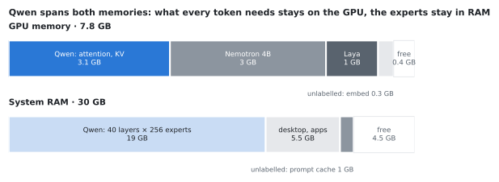</picture>

One `llama-server` in router mode serves three models at once: Qwen3.6-35B-A3B (Q4_K_M, 22 GB file), Nemotron 3 Nano 4B and nomic-embed. Laya (420M parameters) runs in the pipeline process.

## 2. Method

- **Model speed:** `llama-bench` with 3 repetitions per setting (raw data in [`bench/results/phase0/`](../../bench/results/phase0)).
- **Pipeline speed and quality:** `laya-pipeline eval` runs 17 fixed requests from [`eval/cases.jsonl`](../../eval/cases.jsonl). Eight have no document (facts, a greeting, a maths proof, code, a poem). Nine are about two attached documents: a 113 KB server manual and the 19 KB Laya README, including a follow-up question.
- **Quality, scored three ways without a human:**
  1. **Expected facts:** 13 requests have strings the answer must contain, e.g. `8192` or `15:40`.
  2. **Answer check:** Laya's own check, giving the probability that the answer is off-topic or incomplete.
  3. **Agreement:** Laya judges whether two setups' answers agree.
- **Fair comparisons:** the server is restarted before every run, so no run reuses another run's prompt cache.
- **Run files:** every run is saved as JSON in `logs/eval/`. The figures here are generated from those files by [`make_figures.py`](make_figures.py).

## 3. Hypotheses

| # | Hypothesis | Expected | Measured | Verdict |
|---|---|---|---|---|
| H1 | Offloading the KV cache to RAM gets more out of the 9B | more context or a bigger model | compressed prompts are ~2k tokens, so the KV cache was never the limit | ❌ rejected (reasoned) |
| H2 | [glm53-flash-offload](https://github.com/0xSero/glm53-flash-offload) runs on this laptop | maybe | needs 128+ GB RAM, a 24 GB GPU, ~24 cores | ❌ rejected (specs) |
| H3 | A 35B-A3B with every expert in RAM generates at a usable speed | 12–25 tok/s | **42.3 tok/s**, 44 at 8k context | ✅ confirmed, 2× better |
| H4 | Moving expert layers onto the GPU speeds it up a lot | large gain | ~+0.8 tok/s per layer, at ~465 MB VRAM each | 〰️ weak effect |
| H5 | KV cache and experts compete for VRAM | yes | 32k context fits with 32 layers in RAM, not 30 | ✅ confirmed |
| H6 | Reading the prompt is the bottleneck | yes | 237–293 tok/s: a 2k prompt waits ~7 s | ✅ confirmed |
| H7 | Bigger prompt batches read faster | some gain | 273 → **699 tok/s** (ubatch 512 → 2048) | ✅ confirmed |
| H8 | Pinned RAM (no mmap) copies experts faster | large gain | +3% | ❌ rejected |
| H9 | Prompt time grows linearly with length | yes | ~1.5 s fixed **per 2,048-token batch** + ~800 tok/s | ❌ rejected |
| H10 | The prompt cache works on this hybrid (recurrent) model | unsure | repeated 2,203-token prompt: **5.8 s → 0.13 s** | ✅ confirmed |
| H11 | Pre-reading the prompt while Laya routes is worth building | some gain | ≤ 0.1 s: history is already cached | ❌ rejected (reasoned) |
| H12 | All three models fit in VRAM together | unsure | 6.5 GB, all loaded in 9 s | ✅ confirmed |
| H13 | Laya's ~300 ms per decision doesn't matter | yes | judging 6 context chunks took **~5 s** | ❌ rejected |
| H14 | Laya on the GPU is much faster | yes | first try silently fell back to the CPU; as bf16: **18 ms / 130 ms** | ✅ confirmed after a fix |
| H15 | The top 2 chunks by similarity are enough to keep outright | yes | 2 of 3 lookup answers ranked 3rd–4th | ❌ rejected |
| H16 | The 4B small model earns its ~3 GB of VRAM | yes | 172 s vs 214 s for the best Qwen-only setup | ✅ confirmed (speed) |
| H17 | A fixed set of hot experts per layer catches enough routing to beat whole-layer placement | unsure: MoE training spreads load | 39 experts/layer catch **35%** of picks on unseen prompts (uniform: 15%): est. 53.6 vs 46.5 tok/s | ✅ confirmed, needs ~3 GB |
| H18 | Hot experts differ by Laya's task label | maybe | a set per task catches +12 points for code, +13 creative, +6 chat, +1 factual | ✅ confirmed (not for factual) |
| H19 | Caching hot experts also speeds up prompt reading | some gain | a 2,048-token batch touches **232 of 256** experts per layer | ❌ rejected |
| H20 | A dynamic LRU cache (as in glm53-flash-offload) works here | maybe | 69% hits, but every miss is copied over PCIe 3.0: est. 35–69 tok/s depending on overlap; thrashes with 5 slots | 〰️ unproven, risky |
| H21 | Hot experts on the GPU speed up generation as the speed model predicts | +22% (48.5 tok/s) | **39.8 vs 39.7 tok/s**: no gain | ❌ rejected |
| H22 | The prototype's overhead comes from extra GPU↔CPU handoffs | yes | moving the id lookups onto the GPU: 37.8 → 39.8 tok/s, recovers the loss but no gain | 〰️ partly: the rest is sequential GPU work |

## 4. Findings

### 4.1 Generating is cheap, reading is expensive (H3–H9)

<picture><source media="(prefers-color-scheme: dark)" srcset="img/layers-dark.svg">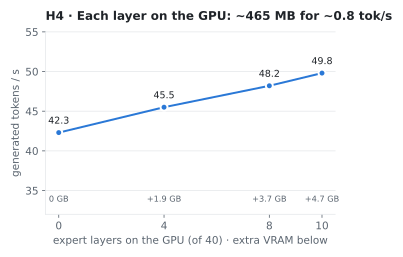</picture> <picture><source media="(prefers-color-scheme: dark)" srcset="img/ubatch-dark.svg">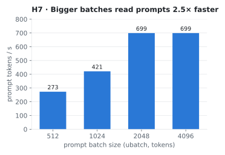</picture>

**Generation:** each token touches only ~0.6 GB of expert weights, which dual-channel DDR4 keeps up with. Moving whole expert layers onto the GPU helps only a little (left). The VRAM is better spent on other models.

**Prompt reading:** for a batch of prompt tokens, llama.cpp copies the RAM experts to the GPU and computes there. Bigger batches mean fewer copies (right). Pinning the RAM didn't speed the copies up (H8). That makes prompt time a staircase, not a line:

<picture><source media="(prefers-color-scheme: dark)" srcset="img/prompt-cost-dark.svg">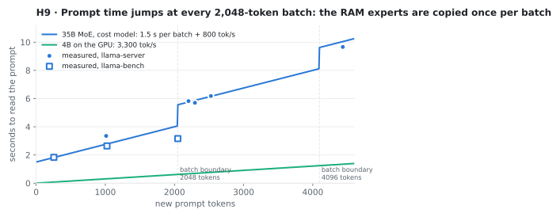</picture>

**How the pipeline uses this:**
- **Context budgets:** Laya's new *scope* question sets the budget at 3, 5 or 11 chunks, about 1k, 1.7k or 3.7k tokens, sized to stay just under one or two batches.
- **Routing:** the curve above is the routing cost model. A hard request still goes to the 4B model (with thinking) when the 35B would need more than 8 s longer just to read the prompt.
- **Prompt cache:** the context moved into the last message, so the system prompt and history stay identical between turns. llama-server reuses them from its prompt cache, which also works on this hybrid model: a retry costs 0.13 s instead of 5.8 s (H10).

### 4.2 The bottleneck we didn't expect (H13–H14)

<picture><source media="(prefers-color-scheme: dark)" srcset="img/laya-dark.svg">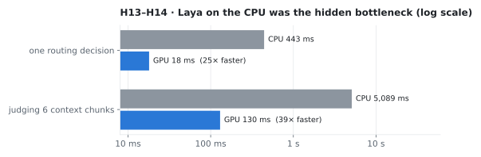</picture>

**The slow part:** Laya's 300 ms routing decision looked harmless. But judging which context chunks are relevant means running its 28-layer encoder over ~2,100 tokens, which took 5 s on the CPU.

**The first GPU attempt failed silently:** Laya ran out of VRAM loading in full precision and quietly stayed on the CPU, so the timings didn't change.

**The fix:** load it on the CPU, convert it to bf16, then move it to the GPU. That takes ~0.9 GB of VRAM. Probabilities change by at most 0.019, and Laya falls back to the CPU on its own if the GPU fills up.

## 5. Result 1: the pipeline before and after

Same models, 17 requests. *Baseline* has the four pipeline changes switched off and Laya on the CPU.

<picture><source media="(prefers-color-scheme: dark)" srcset="img/result1-dark.svg">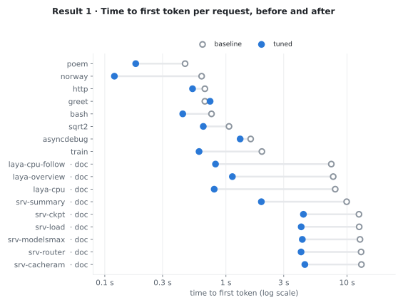</picture>

| | baseline | tuned |
|---|---|---|
| Median time to first token | 7.41 s | **0.82 s** |
| Median time to first token, with a document | 12.53 s | **4.17 s** |
| Total for all 17 requests | 274 s | **173 s** |
| Expected facts found | 11 / 13 | **12 / 13** |
| Laya answer check, mean p(bad) | **0.142** | 0.173 |

**Biggest gains:** the document questions gain the most, because Laya's chunk judging (now on the GPU) and the prompt reading (now in single batches) both sit before the first token.

**Facts:** one more fact found, because chunk selection now keeps the top two-thirds of the budget by similarity (H15).

**Answer check:** the score varies a lot between runs. An earlier tuned run scored 0.137, against 0.173 here.

Runs: `20261002-204946-baseline.json`, `20261002-211207-multi.json`.

## 6. Result 2: does the small model earn its VRAM? (H16)

Without Nemotron 4B, about 3 GB of VRAM frees up. That's enough for Qwen to keep 6 of its 40 expert layers on the GPU (34 in RAM; 33 would leave too little room for Laya). Three setups, same 17 requests, all pipeline changes on (script: [`eval/experiment-qwen-only.sh`](https://github.com/trifleen/laya-pipeline/blob/experiment/qwen-only/eval/experiment-qwen-only.sh) on branch `experiment/qwen-only`):

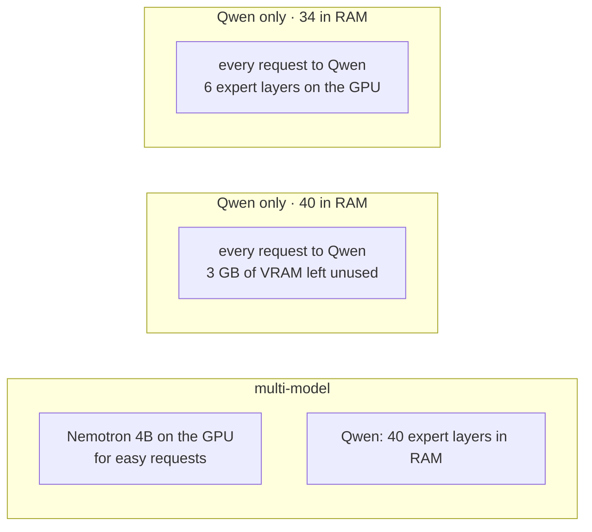

<picture><source media="(prefers-color-scheme: dark)" srcset="img/result2-dark.svg">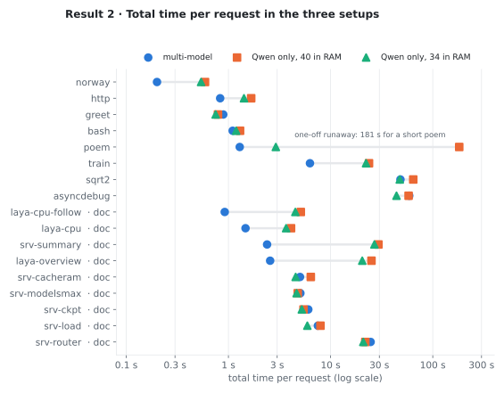</picture>

<picture><source media="(prefers-color-scheme: dark)" srcset="img/result2-totals-dark.svg">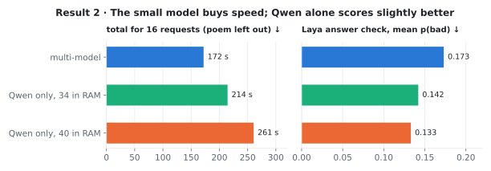</picture>

| | multi-model | Qwen only, 40 in RAM | Qwen only, 34 in RAM |
|---|---|---|---|
| Total for 16 requests (poem left out) | **172 s** | 261 s | 215 s |
| Median first token, no document | 0.57 s | 0.42 s | **0.37 s** |
| Median first token, with a document | 4.17 s | 4.36 s | **3.93 s** |
| Median generation speed | 105 tok/s (Nemotron) · 39 (Qwen) | 38.5 tok/s | **41.8 tok/s** |
| Expected facts found | 12 / 13 | **13 / 13** | 12 / 13 |
| Laya answer check, mean p(bad) | 0.173 | **0.133** | 0.142 |
| Laya: agrees with the multi-model answer | – | 0.69 | 0.75 |

**Verdict: confirmed on speed.**
- **Where the small model wins:** easy requests and summaries of long documents. "Where does Laya run?" takes 1.5 s against 3.7 s; summarizing the 113 KB manual takes 2.4 s against 26.8 s. Requests that Laya routes to Qwen anyway take the same time in every setup.
- **Where Qwen-only wins:** its answers score a little better on Laya's check, with the same facts found.
- **The extra GPU layers:** Nemotron's VRAM spent on 6 expert layers makes Qwen ~3 tok/s faster, as H4 predicted.

**Decision:** multi-model stays the default. Qwen-only with 34 layers in RAM is the quality option: `PRESET=qwen-only N_CPU_MOE=34 serve.sh` with `SMALL_MODEL=qwen3.6-35b-a3b`.

Runs: `20261002-211207-multi.json`, `20261002-211950-qwen-only-40.json`, `20261002-212345-qwen-only-34.json`.

## 7. Phase 1: which experts does Qwen actually use? (H17–H20)

Each of the 40 layers routes every token to 8 of its 256 experts. If a few experts get most of the traffic, those could live on the GPU and the rest in RAM, a finer version of moving whole layers (H4).

**Method.** [`tools/expert-trace`](https://github.com/trifleen/laya-pipeline/tree/experiment/expert-routing/tools/expert-trace) (branch `experiment/expert-routing`) is a small C++ program on llama.cpp's API. It hooks each layer's router output (`ffn_moe_topk`) and records every token's 8 experts. It ran 57 prompts: the 17 eval requests plus 10 each of code, factual and maths, creative writing, and chat. Each prompt is labelled with the task Laya predicts, since that's the label a task-aware cache would use. That gave **8,548 generated tokens** and **19,107 prompt tokens**, × 40 layers.

To keep the estimate honest, hot sets are always **chosen on one half of the prompts and scored on the other**. Picking and scoring on the same prompts (orange line below) flatters the result.

<picture><source media="(prefers-color-scheme: dark)" srcset="img/phase1-coverage-dark.svg">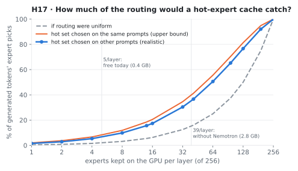</picture>

**H17: routing is concentrated, moderately.** Hot experts catch about **2–3× more** picks than an even spread would. But there's no tiny core of favourites: half of a layer's picks need **54 experts** (median; 42–88 depending on the layer). Each expert is 1.8 MB, so the VRAM budget sets the cache size:
- **0.4 GB free today:** ~5 experts per layer catch ~6% of picks, which is negligible.
- **~2.8 GB without Nemotron:** 39 experts per layer catch **35%** of picks.

<picture><source media="(prefers-color-scheme: dark)" srcset="img/phase1-tasks-dark.svg">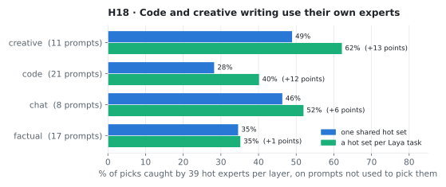</picture>

**H18: tasks use different experts.**
- **Code and creative writing gain most** from their own hot sets, +12 and +13 points. Their top-41 sets overlap by only 9% (Jaccard).
- **Factual questions gain nothing** from a set of their own.
- **This makes Phase 3 meaningful:** Laya already labels the task before generation starts, so the right set could be loaded first.

**H19: no help for prompt reading.** A 2,048-token batch touches 232 of 256 experts per layer, so almost everything is copied to the GPU anyway. Caching only speeds up generation.

**H20: a dynamic cache is bandwidth-bound here.**
- **Hit rate:** an LRU cache of 39 experts per layer hits 69% of picks, twice the static set.
- **The cost:** every miss has to be copied in, ~98 experts × 1.8 MB per token over PCIe 3.0, about 14.5 ms per token.
- **The resulting range:** 35 tok/s if those copies add up, 69 tok/s if they overlap perfectly with the CPU work. With only 5 slots it thrashes.
- **What it would take:** the GLM project gets away with a dynamic cache on PCIe 4.0 by copying in only the warmest misses. Here that would need its own experiment.

<picture><source media="(prefers-color-scheme: dark)" srcset="img/phase1-speed-dark.svg">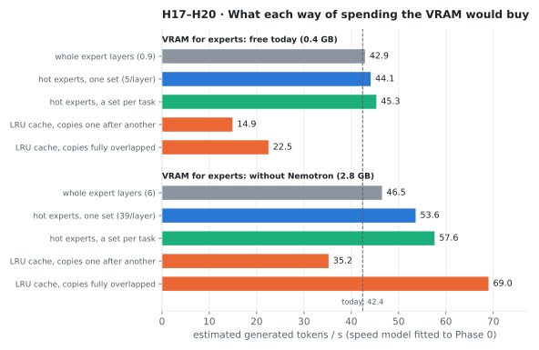</picture>

**Speed estimates** use a model fitted to the Phase 0 measurements: `ms per token = 9.6 + 14.0 × (share of picks computed from RAM)`. It reproduces all four measured placements to within ~1%.

**What it means for the pipeline.** The ~3 GB a hot cache needs is Nemotron's, and H16 showed Nemotron saves 20% of total time. The question is whether a faster Qwen-only setup can catch up:
- **Qwen-only with one hot set:** projected at **~177 s** for the test set.
- **Qwen-only with per-task sets:** projected at **~168 s**.
- **Multi-model today:** 172 s, with slightly weaker answers.
- **How the projection works:** it takes the Qwen-only (34) run and scales its generation time, 171 of its 215 s, by the estimated speed-up.

**Go/no-go: a conditional go for Phase 2.**
- **What would be gained:** a Qwen-only setup with per-task hot experts could match today's speed with Qwen's better answers and no small model.
- **What it would take:** placing single experts on the GPU, which llama.cpp can't do today. Each layer's expert tensors would be split into a hot (GPU) and a cold (CPU) part, with the router's picks remapped between them.
- **Why to wait:** it's a projection from a fitted model, so a small prototype on a few layers should confirm the speed-up before building the full version.

Code and data on branch [`experiment/expert-routing`](https://github.com/trifleen/laya-pipeline/tree/experiment/expert-routing): analysis [`phase1_analysis.py`](https://github.com/trifleen/laya-pipeline/blob/experiment/expert-routing/docs/experiments/phase1_analysis.py) → [`phase1-results.json`](https://github.com/trifleen/laya-pipeline/blob/experiment/expert-routing/docs/experiments/phase1-results.json).

## 8. Phase 2 prototype: hot experts on the GPU (H21–H22)

**What we built.** A ~300-line patch to llama.cpp, on branch [`experiment/hot-experts`](https://github.com/trifleen/laya-pipeline/tree/experiment/hot-experts/tools/hot-experts), with three parts:
1. **Load:** with `LLAMA_HOT_EXPERTS=<file>`, the listed experts of each layer are copied from the RAM tensors into a GPU buffer.
2. **Split:** inside the MoE step, each token's 8 picks go two ways. Hot picks run on the GPU copy and cold picks on the RAM tensors, each side weighted so the sum is unchanged. The model file and the routing are untouched.
3. **Choosing the hot experts:** they come from the 40 extra Phase 1 prompts only. The benchmark used the 17 eval prompts, which weren't used to choose them, and the predicted speeds were written down before measuring ([`phase2_hotsets.py`](https://github.com/trifleen/laya-pipeline/blob/experiment/hot-experts/docs/experiments/phase2_hotsets.py), [`phase2_bench.sh`](https://github.com/trifleen/laya-pipeline/blob/experiment/hot-experts/docs/experiments/phase2_bench.sh)).

**Two bugs on the way, worth knowing for anyone repeating this:**
- **Repeated experts crash the GPU kernel.** Unused slots first all pointed at one stand-in expert, so a token could list the same expert 8 times. llama.cpp's GPU expert kernel assumes each token lists an expert at most once, and it overran memory. Each slot now gets its own stand-in.
- **The crashes showed up as desktop notifications.** Debugging moved under `gdb`, which catches the abort before a core dump.

<picture><source media="(prefers-color-scheme: dark)" srcset="img/phase2-prototype-dark.svg">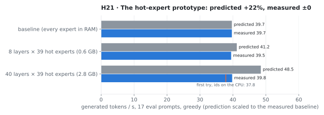</picture>

**H21: no speed-up.** With 39 hot experts in all 40 layers (+3.5 GB of VRAM), generation ran at 39.8 tok/s against 39.7 without them. Prompt reading was unchanged, as H19 predicted (468 against 455 tok/s).

**H22: why the speed model was wrong.**
- **What the model assumed:** a pick served from the GPU costs nothing.
- **How llama.cpp actually runs it:** it executes a layer's GPU and CPU parts one after the other, never side by side.
- **Where the time goes:** a hot layer adds about a dozen small GPU operations (id lookups, three expert multiplies, weighting) to every token, and at one token per step those cost about as much as the RAM reads they replace.
- **The first version was worse:** computing the ids on the CPU added two GPU↔CPU handoffs per layer, about 0.14 ms each per token. Moving them onto the GPU recovered that, but no more.
- **Where the gain would come from:** running the hot experts *at the same time* as the CPU's cold experts. glm53-flash-offload does this with custom kernels and a second GPU stream.

**Answers:** 7 of 17 were identical to the baseline, and on average the first two-thirds of each answer matched. Splitting the 8-expert sum into hot + cold changes the order the numbers are added in. Greedy decoding then diverges wherever two tokens are nearly tied, so a full version would also need the quality checks from Result 2.

**Verdict: no-go for Phase 2 on llama.cpp as it is.** The routing data (Phase 1) supports a hot-expert cache, but this scheduler can't turn it into speed. Making it work means running GPU and CPU in parallel, a much larger project. Phase 3 (task-aware sets) depends on Phase 2, so it's parked too.

Code and data on branch [`experiment/hot-experts`](https://github.com/trifleen/laya-pipeline/tree/experiment/hot-experts): llama.cpp `4ebdf2c` + [`llama.cpp-hot-experts.patch`](https://github.com/trifleen/laya-pipeline/blob/experiment/hot-experts/tools/hot-experts/llama.cpp-hot-experts.patch).

## 9. How far to trust these numbers

- **Small sample, one run per setup.** 17 requests, each run once. Differences of a few percent are within noise. The 20% and 3× gaps are not.
- **Sampling varies.** Answers are generated at temperatures 0.2–0.9, so lengths differ between runs, and length drives total time. That's why first-token times are the cleaner speed measure.
- **Laya's quality checks are shallow and noisy.** The answer check catches off-topic or evasive answers; it doesn't verify facts. Its mean moved by 0.04 between two runs of the same setup.
- **One unexplained outlier.** Qwen once spent 181 s (~7,000 tokens) on a 450-character poem and didn't repeat it in 4 retries. The eval didn't record where those tokens went; it now records answer and thinking tokens. A `max_tokens` cap would bound this.
- **Phase 1 traces use greedy decoding** (no sampling) and 57 prompts; hot sets from a bigger, more varied set would be more stable. The speed estimates assume per-expert placement costs the same per pick as whole-layer placement, which a prototype has to confirm.
- **One fact is missed in almost every setup.** "Which endpoint loads a model?" ranks 50th of 102 chunks by embedding similarity. Only one Qwen-only run got it, apparently from the model's own knowledge.

## 10. Reproduce

On `main` (model server set up as in [`serve/README.md`](../../serve/README.md)):

```bash
bench/sweep.sh 40,36,32,30                           # Phase 0: llama-bench placement sweep
eval/ab.sh                                           # Result 1: baseline vs tuned
uv run --with matplotlib python docs/experiments/make_figures.py \
  logs/eval/<baseline>.json logs/eval/<multi>.json logs/eval/<qwen-only-40>.json logs/eval/<qwen-only-34>.json
```

On the experiment branches:

```bash
git switch experiment/qwen-only                     # Result 2: three setups
eval/experiment-qwen-only.sh

git switch experiment/expert-routing                # Phase 1 (stop llama-server first)
tools/expert-trace/build.sh
uv run python tools/expert-trace/make_prompts.py logs/phase1
tools/expert-trace/expert-trace $MODELS/Qwen3.6-35B-A3B-UD-Q4_K_M.gguf logs/phase1/prompts.jsonl logs/phase1/trace.bin 192
uv run --with matplotlib --with numpy python docs/experiments/phase1_analysis.py logs/phase1

git switch experiment/hot-experts                   # Phase 2 (llama.cpp 4ebdf2c + tools/hot-experts/llama.cpp-hot-experts.patch)
uv run --with numpy python docs/experiments/phase2_hotsets.py logs/phase1 logs/phase2
docs/experiments/phase2_bench.sh baseline 8layers-k39 all-k39
uv run --with matplotlib python docs/experiments/phase2_figure.py logs/phase2
```

[`report.html`](report.html) is an interactive version of sections 1–6 (built by `build_report.py`). GitHub shows its source, so download it and open it locally.

## 11. Open questions

- **Running hot and cold experts at the same time.** The hot multiplies would go on a second GPU stream while the CPU computes the cold ones. Phase 1 says the payoff would be ~+25% generation speed with ~3 GB of VRAM, if the overlap works.
- **Follow-ups with a document** reuse only the system prompt from the cache, because history is sent without the earlier context.
- **Recalibration:** Laya's calibration was fitted on its CPU probabilities, and bf16 shifts them by up to 0.02.
